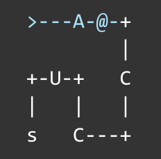

# Pabau Intership application assignment.

The objective of this assignment is to identify the specific path or route in the matrix and collect every uppercase letter.

In addition to the assignment matrix, I've included three other matrices to ensure that my solution is versatile and thoroughly tested.

----

If you'd like to see the code in action in real-time, please install the dependencies using `npm install`, then run the development server with `npm run dev`. Alternatively, you can simply open the online **[DEMO](https://adorable-malabi-f1e606.netlify.app/)** in a web browser.

I've also included basic tests which you can run using Jest or Vitest. Execute the tests with `npm run test`.

Enjoy!

